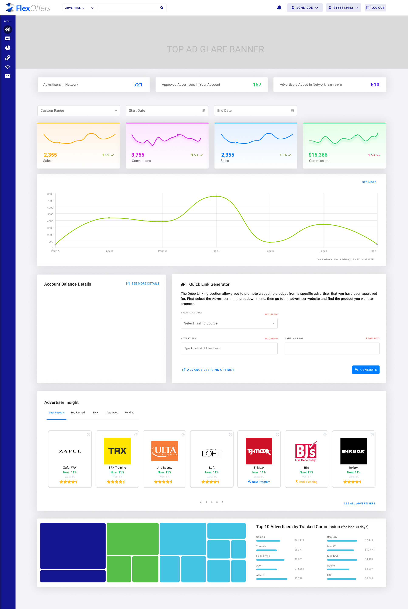

# ⚡ Frontend Developer Portfolio – Abhishek Ranjan

Welcome to my frontend development portfolio! I specialize in building modern, scalable React.js applications with seamless user experiences. With 4 years of professional experience and expertise in full-stack integration, I bring both technical excellence and business value to every project.

---

## 👤 Profile Summary

<!-- Add your professional image here -->
![Abhishek Ranjan]

- **4 years** of professional experience developing React.js applications with Material UI, Redux/Redux-Saga, and KendoReact
- Specialized in **SSO integration (Okta)**, Chrome extension development, and performance optimization
- Strong background in **full-stack collaboration** with ASP.NET Core backends and MySQL databases
- Proven track record of improving platform performance, user engagement, and developer efficiency in Agile environments

---

## 🧠 Skills

**Frontend:** React.js, TypeScript, React Router, Redux, Redux-Saga, HTML5, CSS3  
**UI Libraries:** Material UI (MUI), KendoReact, Bootstrap  
**Backend & Database:** ASP.NET Core, REST APIs, MySQL, SQL Server  
**DevOps & Tools:** Azure DevOps, Git, CI/CD, Postman, Figma  
**Authentication & Cloud:** Okta SSO, AWS (fundamentals)  
**Testing & Practices:** Jest, React Testing Library, Agile/Scrum, Code Reviews

---

## 💼 Professional Experience

**Monocept, Gurgaon — Frontend Engineer (React.js)**  
*August 2021 – Present*

- Built and maintained **React.js portals** for affiliate program management across Control, Publisher, and Advertiser applications
- Developed a **Chrome Extension** for in-page program discovery, significantly reducing enrollment time and increasing publisher participation
- Integrated **Okta SSO** with role-based access control, standardizing authentication flows and reducing support issues
- Modernized UI using **Material UI and KendoReact**, improving design consistency and reducing CSS-related defects
- Implemented **Redux-Saga** for complex async workflows, enhancing error handling and reducing API call failures
- Collaborated with backend teams to optimize API contracts and pagination strategies for faster data retrieval

**COSO IT — Frontend Intern**  
*January 2021 – July 2021*

- Designed UI for "First Online University" platform with distinct Teacher/Learner roles and admin management views
- Contributed **reusable React components** and improved user onboarding flows
- Supported early content population using open-source educational resources

---

## 🚀 Featured Project

### 🔗 FlexOffers Affiliate Platform
*August 2021 – Present*

- Engineered comprehensive affiliate management system with **three integrated portals** (Control, Publisher, Advertiser)
- Built **Chrome Extension** enabling seamless program discovery and enrollment directly from web pages
- Implemented **Okta SSO integration** for enterprise-level security and user management
- Utilized **Redux-Saga** for managing complex state workflows including offers ingestion and approval processes
- Achieved significant improvements in platform performance and user engagement metrics

**🔗 Live Demo:** [FlexOffers Platform](https://publisherprobeta.flexoffers.com/flexapps/flexlinks)

---

## 💡 Additional Projects

### 🦠 COVID-19 Thermal Screening System
*January 2020 – July 2020*
- Developed Python-based face detection and temperature capture system using **OpenCV and thermal cameras**
- Implemented Excel-based logging for screening and symptom detection prototype
- **Tech Stack:** Python, OpenCV, Thermal Camera

### 🛡️ Insurance Management System  
*August 2019 – October 2019*
- Built multi-role application with admin/user access, insurance search functionality, and **Instamojo payment integration**
- Added face detection security features and comprehensive record-keeping system
- **Tech Stack:** Laravel, PHP, MySQL, JavaScript

---

## 🎓 Education

**Master of Computer Applications (MCA)**  
*NIT Allahabad (Motilal Nehru National Institute of Technology)*  
*2018 – 2021 | CPI: 7.45*

**Bachelor of Computer Applications (BCA)**  
*VKS University, Ara*  
*2015 – 2018 | 77.04%*

---

## 🏆 Leadership & Activities

- **Speaker Series Conductor** at Monocept – Led knowledge transfer sessions and facilitated project ideation meetings
- **Technical Mentor** – Guided junior developers and conducted code review sessions
- **Agile Champion** – Drove sprint planning and CI/CD pipeline implementation using Azure DevOps

---

## 📬 Let's Connect!

- 📧 **Email:** [mnnit4abhishek@gmail.com](mailto:mnnit4abhishek@gmail.com)
- 🔗 **LinkedIn:** [linkedin.com/in/abhishek-ranjan-mnnit](https://www.linkedin.com/in/abhishek-ranjan-mnnit/)
- 📱 **Phone:** +91-9151726759
- 📍 **Location:** Gurugram, Haryana

---

Thanks for exploring my portfolio! I'm passionate about creating exceptional user experiences and would love to collaborate on your next React.js project. Feel free to reach out for opportunities or technical discussions!
